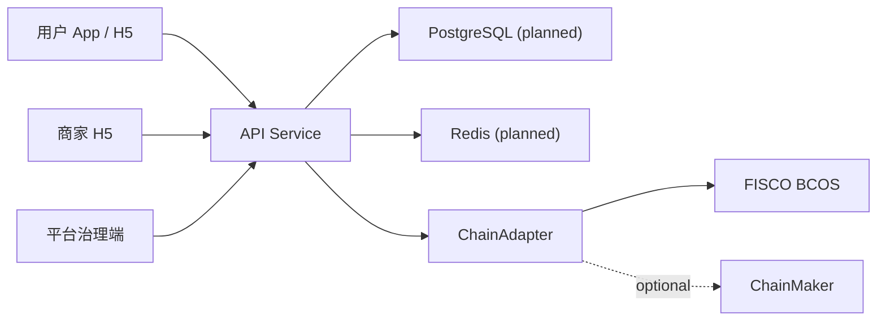

# 零界 MVP 架构说明

## Product Shape

第一版围绕“咖啡夜行路线”验证真实线下履约，而不是先做完整虚拟世界。

- 用户端：路线领取、扫码核销、权益钱包、零界 ID、数据授权。
- 商家端：数字门店、任务发布、核销记录、基础看板。
- 治理端：商家审核、任务反作弊、链上存证查询、投诉与合规规则。

## Runtime Architecture

当前代码用内存仓库模拟 PostgreSQL/Redis，接口边界保持稳定，便于后续替换为 Spring Boot 服务。

## Data Boundary

链下保存：

- 手机号、设备、位置、订单、评价、门店信息、权益详情、用户画像。

链上保存：

- `userDidHash`
- `merchantId`
- `taskId`
- `receiptHash`
- `consentHash`
- `timestamp`
- `status`
- `txId`

链上只用于审计和可信证明，不作为业务主账本；业务主状态仍由后端数据库控制。

## Compliance Defaults

- 零界能量不上链、不提现、不转让、不兑换现金。
- 数字票根不可转让、不可提现，必须绑定真实权益、使用期限和退出方案。
- 数据授权必须包含用途、期限、回报、撤回能力和审计记录。
- 不提供收益承诺、二级市场、炒作入口或类虚拟货币能力。
